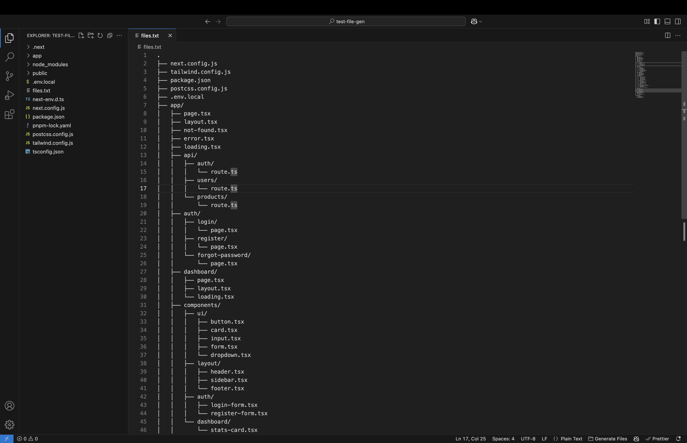

# File Structure Generator Pro

Generate file and directory structures from text descriptions in VS Code. This extension allows you to quickly scaffold project structures by parsing ASCII tree diagrams and turning them into actual files and directories.



## Features

- **Parse ASCII Tree Diagrams**: Convert tree diagrams with `├`, `└`, and `│` characters into actual file structures.
- **Smart Templates**: Automatically apply content templates based on file extensions and Next.js conventions.
- **Inline Content**: Define file content directly in your structure file using code blocks.
- **Progress Visualization**: See real-time progress as files and directories are created.
- **Configurable Options**: Customize behavior via the command palette or VS Code settings.
- **Status Bar Integration**: Quickly access the generator from the status bar.

## Usage

### Basic Usage

1. **Create a Structure File**

   Create a text file in VS Code containing your desired file structure in ASCII tree format.  
   **Important:**

   - Each line must use the tree characters (`├`, `└`, `│`) to denote hierarchy.
   - Do not leave extra blank lines or additional characters outside the tree symbols.
   - Root-level files (outside folders) should be written at the top of your file.

   For example, to create a simple structure with only an `app/` folder and its subfolders:

   ```txt
   app/
   ├── api/
   │   ├── users/
   │   │   └── route.ts
   │   └── auth/
   │       └── route.ts
   ├── components/
   │   ├── ui/
   │   │   ├── button.tsx
   │   │   └── input.tsx
   │   └── layout/
   │       ├── header.tsx
   │       └── footer.tsx
   └── styles/
       └── globals.css
   ```

2. **Generate the File Structure**

   - With the file open, right-click in the editor and select **Generate File Structure from Current File**.
   - You will be prompted to enter a base directory (or leave empty to use the workspace root).
   - Confirm the operation, and the extension will create all the files and directories according to your diagram.

### Advanced Usage: Including File Content

You can define the content for a file directly in your structure file using inline code blocks. To do this, follow these steps:

1. Write the file name on its own line in the tree diagram.
2. Immediately after the file line, insert a code block defined by triple tildes (~~~) instead of backticks.
3. Place your desired file content between the opening and closing triple tildes.

For example, to create a file with custom React component content:

```txt
app/
└── components/
    └── button.tsx
```

Immediately following the file name, add your inline content within triple tildes ` ```inline content here``` `:

Example:

```
import React from 'react';

interface ButtonProps {
text: string;
onClick?: () => void;
}

export default function Button({ text, onClick }: ButtonProps) {
return (
<button
      className="px-4 py-2 bg-blue-500 text-white rounded"
      onClick={onClick}
    >
{text}
</button>
);
}
```

Everything between the inner triple tildes is used as the file content when the extension creates `button.tsx`.

### Next.js Project Templates

The extension integrates comprehensive Next.js templates to scaffold your Next.js projects quickly. To generate a Next.js project structure:

1. Run the **Create Next.js Project** command.
2. Choose your project type (Basic, Full-stack, Dashboard, or Blog).
3. Review the temporary file preview that appears.
4. Confirm the structure to let the extension generate your project.

The Next.js templates include specific file types such as:

- **page.tsx** – A basic page component with metadata.
- **layout.tsx** – A root layout component.
- **loading.tsx** – A simple loading indicator.
- **error.tsx** – A client error component with a reset button.
- **not-found.tsx** – A page not found component.
- **route.ts** – A template for API routes.
- **component.tsx** / **server-component.tsx** – Templates for React components.
- **middleware.ts** – Middleware logic template.
- **actions.ts** – A server action template for form submission and login handling.
- **Config Files**: Templates for `next.config.js` and `tailwind.config.js`.

### Complete NextJS project structure example

```
.
├── next.config.js
├── tailwind.config.js
├── package.json
├── postcss.config.js
├── .env.local
├── app/
│   ├── page.tsx
│   ├── layout.tsx
│   ├── not-found.tsx
│   ├── error.tsx
│   ├── loading.tsx
│   ├── api/
│   │   ├── auth/
│   │   │   └── route.ts
│   │   ├── users/
│   │   │   └── route.ts
│   │   └── products/
│   │       └── route.ts
│   ├── auth/
│   │   ├── login/
│   │   │   └── page.tsx
│   │   ├── register/
│   │   │   └── page.tsx
│   │   └── forgot-password/
│   │       └── page.tsx
│   ├── dashboard/
│   │   ├── page.tsx
│   │   ├── layout.tsx
│   │   └── loading.tsx
│   ├── components/
│   │   ├── ui/
│   │   │   ├── button.tsx
│   │   │   ├── card.tsx
│   │   │   ├── input.tsx
│   │   │   ├── form.tsx
│   │   │   └── dropdown.tsx
│   │   ├── layout/
│   │   │   ├── header.tsx
│   │   │   ├── sidebar.tsx
│   │   │   └── footer.tsx
│   │   ├── auth/
│   │   │   ├── login-form.tsx
│   │   │   └── register-form.tsx
│   │   └── dashboard/
│   │       └── stats-card.tsx
│   ├── lib/
│   │   ├── utils.ts
│   │   ├── api.ts
│   │   ├── db.ts
│   │   └── auth.ts
│   ├── middleware.ts
│   ├── providers.tsx
│   └── styles/
│       └── globals.css
└── public/
    ├── images/
    │   └── logo.svg
    └── favicon.ico
```

### Writing Root-Level Files

If you need files to be created in the project root (e.g., `next.config.js`, `package.json`), you have two options:

1. **Place Root Files Before the `app/` Folder:**  
   List them at the top of your structure file. For example:

   ```
   next.config.js
   tailwind.config.js
   package.json
   postcss.config.js
   .env.local
   app/
   ├── page.tsx
   └── ...
   public/
   ├── images/
   │   └── logo.svg
   └── favicon.ico
   ```

2. **Use a Dot (`.`) as the Root:**  
   Starting your file with a dot ensures the extension recognizes these as items in the workspace root:

   ```
   .
   ├── next.config.js
   ├── tailwind.config.js
   ├── package.json
   ├── postcss.config.js
   ├── .env.local
   ├── app/
   │   └── ...
   └── public/
       └── favicon.ico
   ```

### Templates Documentation

#### Default Templates

By default, the extension provides content templates for common file types:

- **.tsx**: A basic React component.
- **.ts**: An empty TypeScript module.
- **.js**: A basic JavaScript file.
- **.jsx**: A basic React component in JavaScript.
- **.css**: A placeholder comment.
- **.html**: A minimal HTML document.

These can be customized through the **Configure File Structure Generator** command.

#### Next.js Templates

The extension also comes with Next.js–specific templates that include:

- **page.tsx**
- **layout.tsx**
- **loading.tsx**
- **error.tsx**
- **not-found.tsx**
- **route.ts**
- **component.tsx** / **server-component.tsx**
- **middleware.ts**
- **actions.ts**
- **Config Files**: `next.config.js`, `tailwind.config.js`

These templates are automatically registered and can be extended or overridden by your custom templates.

#### Template Flow

When generating a file, the extension checks:

1. **Inline Content:** Is there a code block right after the file name?
2. **Next.js Specific Template:** Is a Next.js template applicable based on the file name?
3. **Default Template:** Does a default template exist for the file’s extension?
4. **Empty File Option:** If no template is found and the option is enabled, an empty file is created.

This flexible approach ensures that the generated files have the appropriate starter code based on your project needs.

## Configuration

You can adjust the following settings via the command palette (**Configure File Structure Generator**) or VS Code settings:

- **Create Empty Files**: Create files even when no content is provided.
- **Create Intermediate Directories**: Automatically create necessary parent directories.
- **Overwrite Existing Files**: Replace files if they already exist.
- **Parse Comments**: Lines starting with `//` or `#` in your structure file will be ignored.
- **Ignore Blank Lines**: Skip blank lines during parsing.

## Examples

### Example 1: Simple Component Structure

```
components/
├── auth/
│   ├── Login.tsx
│   ├── Register.tsx
│   └── ForgotPassword.tsx
├── layout/
│   ├── Header.tsx
│   ├── Footer.tsx
│   └── Sidebar.tsx
└── common/
    ├── Button.tsx
    ├── Input.tsx
    └── Card.tsx
```

### Example 2: Backend API Structure

```
api/
├── controllers/
│   ├── userController.ts
│   ├── authController.ts
│   └── productController.ts
├── models/
│   ├── User.ts
│   ├── Product.ts
│   └── Order.ts
├── routes/
│   ├── userRoutes.ts
│   ├── authRoutes.ts
│   └── productRoutes.ts
└── middleware/
    ├── auth.ts
    ├── validation.ts
    └── errorHandler.ts
```

## Tips

- **Comments:** You can add comments using `//` or `#`. They will be ignored when creating files.
- **Complex Structures:** For very complex or nested structures, keep your file clean and avoid extra whitespace.
- **Quick Access:** Use the status bar button to generate your structure quickly.

## Requirements

- VS Code 1.60.0 or higher

## Extension Settings

The extension contributes these settings:

- `fileStructureGenerator.createEmptyFiles`
- `fileStructureGenerator.createIntermediateDirectories`
- `fileStructureGenerator.overwriteExisting`
- `fileStructureGenerator.parseComments`
- `fileStructureGenerator.ignoreBlankLines`

## Known Issues

- Very large file structures may take longer to process.
- Complex nested content blocks might not parse correctly.

## Release Notes

### 1.0.0

- Initial release with core functionality:
  - ASCII tree parsing
  - File and directory creation
  - Template support (including Next.js)
  - Inline content support
  - Configuration options

## License

MIT

---

Enjoy generating your project structures quickly in VS Code!
